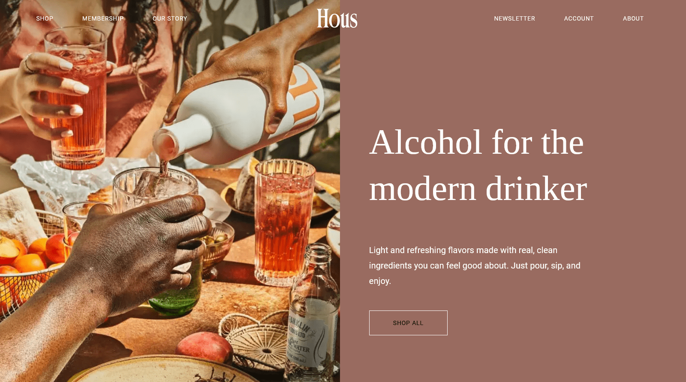

# [Одностраничный сайт](https://sergeywave.github.io/hous-pet-project/) алкогольного бренда (пет-проект)

- Адаптивный дизайн. Сайт красиво отображается на различных устройствах.
- Доступность. Интерфейс сайта доступен для людей с ограниченными физическими или техническими возможностями.
- Верстка по методологии БЭМ.
- Оптимизация сайта для ускорения загрузки. Показатели 100 по Google PageSpeed Insights.
- Оригинальная CSS анимация кнопок.

---

# [Single-page website](https://sergeywave.github.io/hous-pet-project/) (pet-progect)

- Responsive design. The website beautifully displayed on various devices.
- Accessibility. The website interface is convenient for people with disabilities.
- BEM (Block, Element, Modifier) approach.
- Graphic and code optimization. 100 rates on Google PageSpeed Insights.
- Original buttons CSS animation.
   

